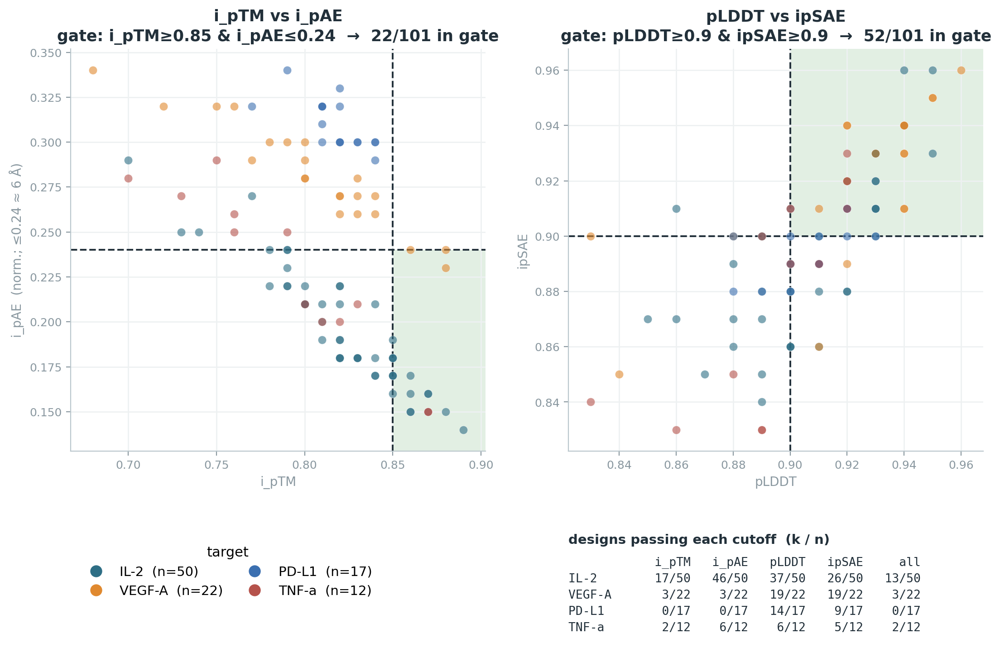

# bindome-query

Query the [**Human Bindome**](https://bindome.epfl.ch) for a list of protein
targets and get tidy per-design metrics, a per-target summary, and a figure of
the binder-confidence distribution.

The Human Bindome (Wenckstern *et al.*, bioRxiv
[2026.07.30.741542](https://www.biorxiv.org/content/10.64898/2026.07.30.741542v1))
is a proteome-scale atlas of ~306,000 *in-silico* [BindCraft](https://github.com/martinpacesa/BindCraft)
binder candidates covering ~8,300 human proteins (40.9% of the proteome). For
every target it exposes one record per designed binder, each with AlphaFold-style
confidence metrics and links to the predicted binder–target complex.

> **These are computational design candidates, not experimentally validated
> binders.** There is no measured affinity in the Bindome — the metrics
> (`i_pTM`, `i_pAE`, `pLDDT`, …) are design-time confidence only. Use them to
> triage, not to conclude a target "has a binder."



## Install

```bash
pip install -r requirements.txt
```

## Usage

```bash
python bindome_query.py --targets targets.example.json --outdir out
```

Add `--top-structures N` to also download the top-N binder CIFs per target
(ranked by `i_pTM`) into `out/structures/`.

### Targets file

A JSON list of `{name, uniprot}`. A bare list of accession strings also works.

```json
{
  "targets": [
    { "name": "PD-L1",  "uniprot": "Q9NZQ7" },
    { "name": "VEGF-A", "uniprot": "P15692" },
    { "name": "IL-2",   "uniprot": "P60568" }
  ]
}
```

### Name resolution

If you omit `uniprot`, the name is resolved against UniProt (reviewed, human).
Resolution is **tolerant of case, spacing, hyphens, and gene-vs-protein names** —
`CLDN6`, `Claudin-6`, `claudin 6`, `PD-L1`, `pdl1`, and `HER2` all resolve
correctly. It matches by *exact normalized name*, so it will **never silently
pick the wrong protein** (naive fuzzy search maps `claudin 6` to Claudin-9 and
`her-2` to HERC3 — this tool does not).

For a genuine typo it does **not** guess. It prints the closest "did you mean"
candidates and skips that target:

```
[resolve] 'claudn 6': no exact match; did you mean: CLDN6 (P56747), CLDN16 (Q9Y5I7), ...
          -> skipping (add an explicit "uniprot" to use one)
```

UniProt has no fuzzy search, and for design work a wrong-target match is worse
than a clean miss. **For anything load-bearing, put the accession in the file** —
it's the primary key the Bindome API uses anyway.

## Outputs

| File | Contents |
|---|---|
| `out/bindome_designs.csv` | one row per designed binder — target, UniProt region hit (`uniprot_start/end`), parsed design fields (`domain`, `binder_length`, `seed`, `mpnn_variant`, `af_model`), all seven metrics, and `model_url`/`pae_url` |
| `out/bindome_summary.csv` | one row per target — `n_binders`, `n_regions`, and best/median of every metric |
| `out/bindome_metrics.png` | two metric-vs-metric **gate scatters** (`i_pTM` vs `i_pAE`, `pLDDT` vs `ipSAE`) colored by target, with the passing corner shaded and dashed cutoff lines, plus a target key and a per-target pass-rate table |

## Metrics

All values are **normalized to 0–1** as returned by the API. Higher is better for
`i_pTM`, `pTM`, `pLDDT`, `i_pLDDT`, `ipSAE`; **lower** is better for `i_pAE`,
`pAE`. `uniprot_start`/`uniprot_end` tell you which region of the target each
binder was designed against — useful for checking whether a candidate overlaps an
epitope you care about.

**Cutoffs used in the figure** (normalized units): `i_pTM ≥ 0.85`,
`i_pAE ≤ 0.24`, `pLDDT ≥ 0.90`, `ipSAE ≥ 0.90`. Note `i_pAE` is normalized
≈ Å/25 (calibrated against the raw PAE matrices), so **`i_pAE ≤ 0.24 ≈ 6 Å`** —
`0.6` would be ~15 Å. Edit `THRESHOLDS` in `bindome_query.py` to change them.
These are **in-silico BindCraft design metrics, not measured affinity.**

## API notes

The tool uses one unauthenticated endpoint:

```
GET https://bindome.epfl.ch/uniprot/{UNIPROT_AC}/metrics
```

There is no batch/list endpoint — this tool simply loops over your targets. For
bulk access (all sequences + structures + ML splits) the authors publish the full
dataset on Hugging Face: [`wjulius/HumanBindome`](https://huggingface.co/datasets/wjulius/HumanBindome).

## Tests

```bash
pip install -r requirements-dev.txt
pytest -q
```

Tests are fully offline (no API calls) — they cover design-name parsing, the
name-resolver safety logic, the metric tables (including no-double-count and
lower-is-better handling), and a figure smoke test. CI runs them on Python
3.10–3.12 (`.github/workflows/ci.yml`).

## License

MIT. The Human Bindome data is CC-BY-4.0; cite the paper if you use it.
